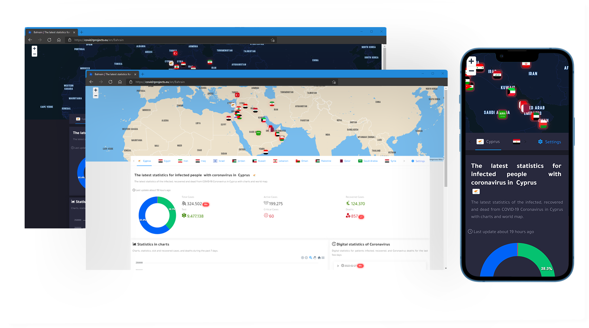

# 👋 Introduction

## ****[**COVID-19 statistics**](http://covid.tprojects.eu) ****&#x20;

is a web application for showing countries that have been affected by the COVID-19 virus. As a chart, map, and percentages.

## Requirements 

* nodejs >= 16.13.2
* PHP >= 8.1.1
* Mapbox account
* RapidApi account

## Features&#x20;

* interactive map to show the countries and their cases.
* past 7 days statistics.
* 4 charts type.
* Responsive design with all devices.
* Cure percent.
* Multi-languages support.
* 4 languages are ready to use, Arabic, English, Chinese, and Turkish. you can add more from the [Configurations page](configurations.md#languages).
* RTL supported.
* 5 types of cases are available, active cases, Recovered, Critical, Deaths, and tests included.
* dark mode supported with wonderful UI design.
* cache API requests for best performance and fast load page.

## Demo&#x20;



## Author

[Tawfek.M](https://github.com/tawfek)
