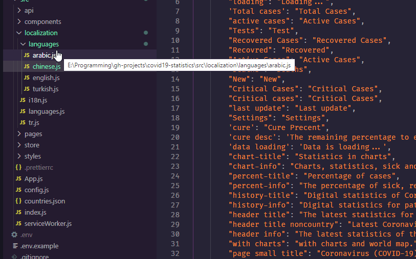
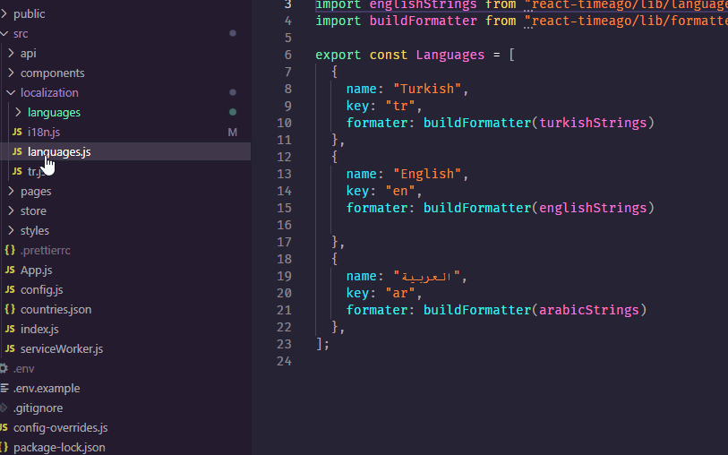
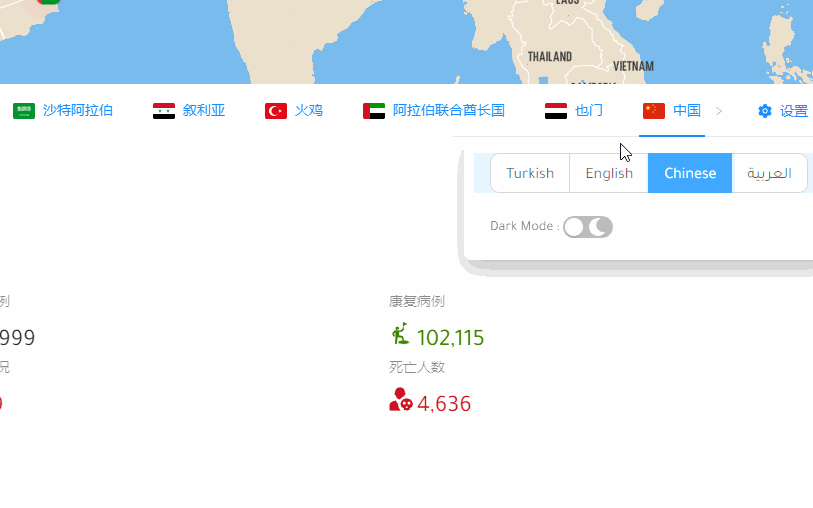
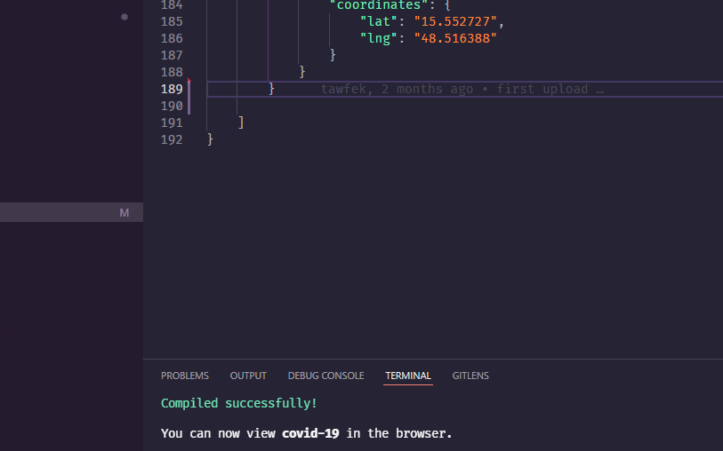
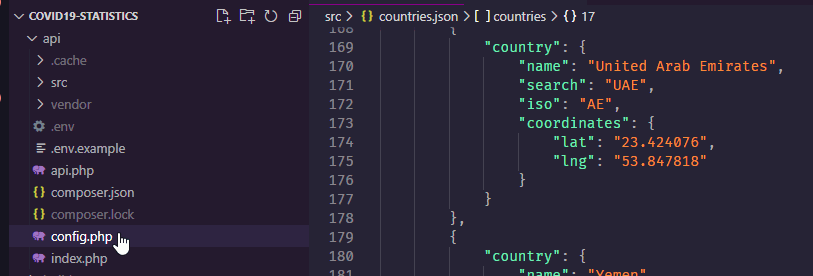
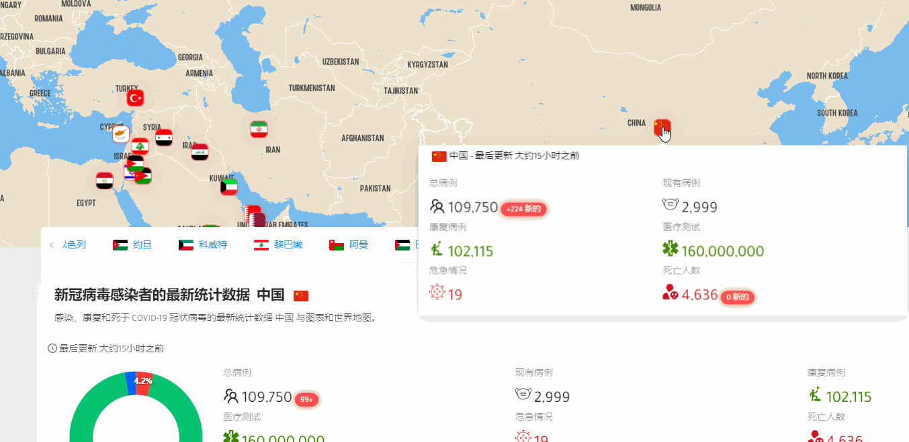
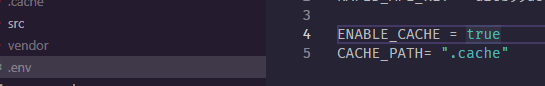

# 🦾 Configurations

You can modify the languages, add a new language, change the default language or modify the languages, enable|disable the cache, and add or delete supported countries.

## 🌐 Adding a new language

the best way to learn is to show an example, in this example we will add the Chinese language to our app, please follow the steps below :

1- go-to the [languages folder](https://github.com/tawfek/covid19-statistics/tree/master/src/localization/languages) and make a new file named with the language name. then change its contents.

2- import the language you added to the [i18n file](src/localization/i18n.js)

3- lastly let's add the language to the settings menu, we do that by modifying the [languages.js file](src/localization/languages.js)


Please note: react-timeago has its own languages you can find the list of supported

languages here [react-timeago](https://github.com/nmn/react-timeago/tree/master/src/language-strings)


4- Now your application is supporting a new language 🥳 how easy was that?

## 🗺️ Adding a new country

the best way to learn is to show an example, in this example we will add the china to the supported countries to our app, please follow the steps below :&#x20;

1- inside [src/conutries.json](src/countries.json) add your language name, iso, coordinates, and the search name that available from the [sport-api/covid-193](https://rapidapi.com/api-sports/api/covid-193) :&#x20;

2- add the country search object to the supported country list inside the [config.php](api/config.php) file :&#x20;

3- Now you have added a new country in your application 🥳

## 🪙 Configuring cahce

The Cache is very important for the performance and for lowering the usage of APIs by making fewer requests. I use [phpfastcache](https://www.phpfastcache.com) for caching, the cache will be saved as a file. you can change it with Redis or any other methods you want.&#x20;

the cache is enabled by default, you can disable it or change the folder of caching from the [.env file](api/.env.example)

## Pull requests and issues&#x20;

feel free to [submit an issue](https://github.com/tawfek/covid19-statistics/issues/new) when catching a bug. or [submit a pull request](https://github.com/tawfek/covid19-statistics/pulls) for new features 🤝.

## Author

[Tawfek.M](https://app.gitbook.com/u/17A11cZFd2PsaOoaw725WGZGhm13)

